# Space Master

Space Master is a short interactive educational quiz for all age groups that involves answering questions related to space and the solar system. Easy to navigate for all ages and users of technology

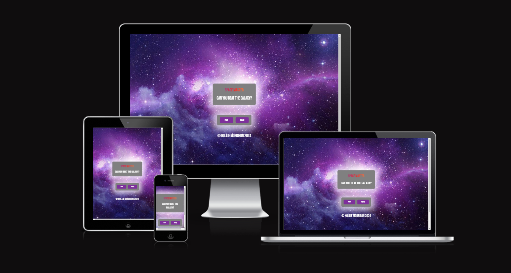
[View 5 super foods your body needs live project here](https://holliemorrison.github.io/space-master/)

## Table of contents :

### [User Experience (UX)](#user-experience-ux-1)
* [User Stories](#user-stories)
### [Features](#features)
* [Existing Features](#existing-features)
### [Features Left To Implement](#features-left-to-implement-1)
### [Design](#design-1)
### [Technologies Used](#technologies-used-1)
### [frameworks](#frameworks-libraries-programs-used-1)
### [Testing](#testing-1)
* [Validation Results](#validation-results)
* [Manual Testing](#manual-testing)
* [Lighthouse Report](#lighthouse-report)
### [Deployment and local development](#deployment-and-local-development-1)
* [GitHub Pages](#github-pages)
* [Forking the GitHub Repository](#forking-the-github-repository)
* [Local Clone](#local-clone)
### [Credits](#credits-1)
### [Acknowledgements](#acknowledgements-1)
---

## User Experience (UX)

This website was made to attract users who want to learn and test their knowledge about space.

There is clear navigation to be used on all pages.

People can interact with this short quiz and allows people of all ages to be included.

### User Stories

*First-time visitor goals
  * Understand the main purpose of the site and answer quiz questions about space.
  * To navigate the site easily.
  * To go through the questions and receive an end result message based on their points.

- - -

## Features

* Home page with a play button and rules page.
* 8 fun questions about space.
* In future, there would be more questions added.

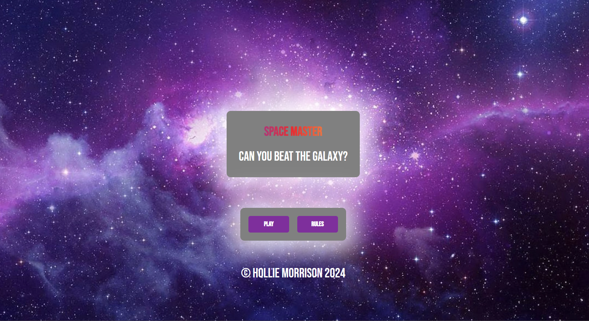
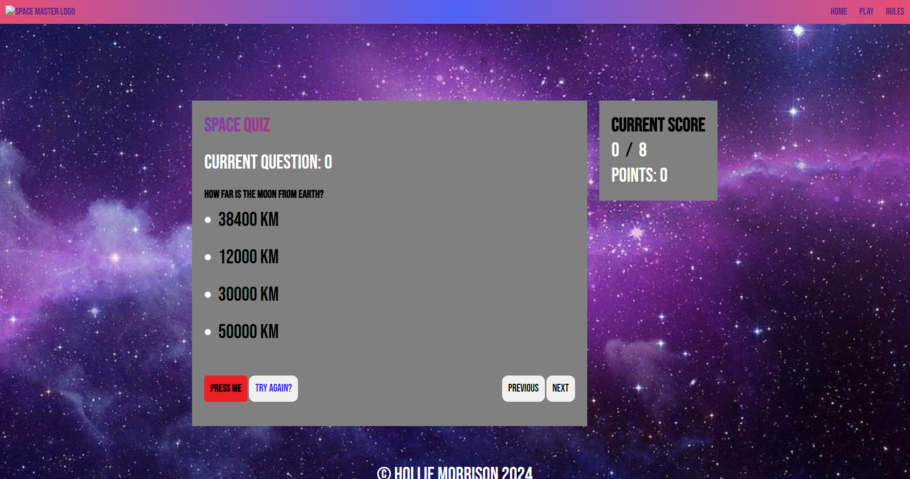
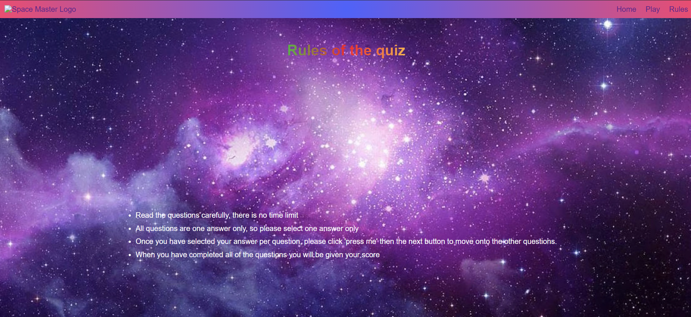

## Design

* Simple design with basic colors and fonts for accessibility and simplicity on the eyes.
* Curved edges on home page to relax the eyes and not appear so harsh.
* Space themed background to get the users attention.

## Technologies Used

* [HTML5]((https://en.wikipedia.org/wiki/HTML5))
* [CSS3]((https://en.wikipedia.org/wiki/CSS))
* [JavaScript]((https://en.wikipedia.org/wiki/JavaScript))

## Frameworks, Libraries & Programs Used

* [Github](https://github.com/)
    * Deployment of the website and storing the files online.
* [Am I Responsive](https://ui.dev/amiresponsive?url=https://holliemorrison.github.io/space-master/)
    * Mockup picture for the README file.
* [Visual Studio Code](https://code.visualstudio.com/)

---

## Testing

The W3C Markup Validator and W3C CSS Validator services were used to validate every page of the project to ensure there were no errors.

 * [W3C Markup Validtor](https://validator.w3.org/)
 * [W3C CSS Validator](https://jigsaw.w3.org/css-validator/)
 * [JShint Javascript Validator](https://jshint.com/)

### Validation results

index.html

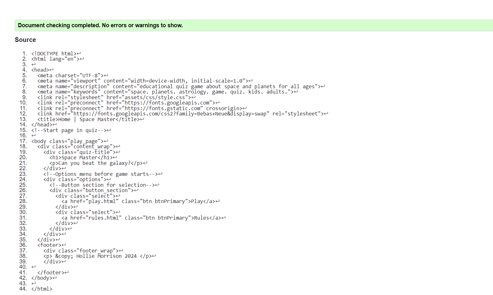

play.html

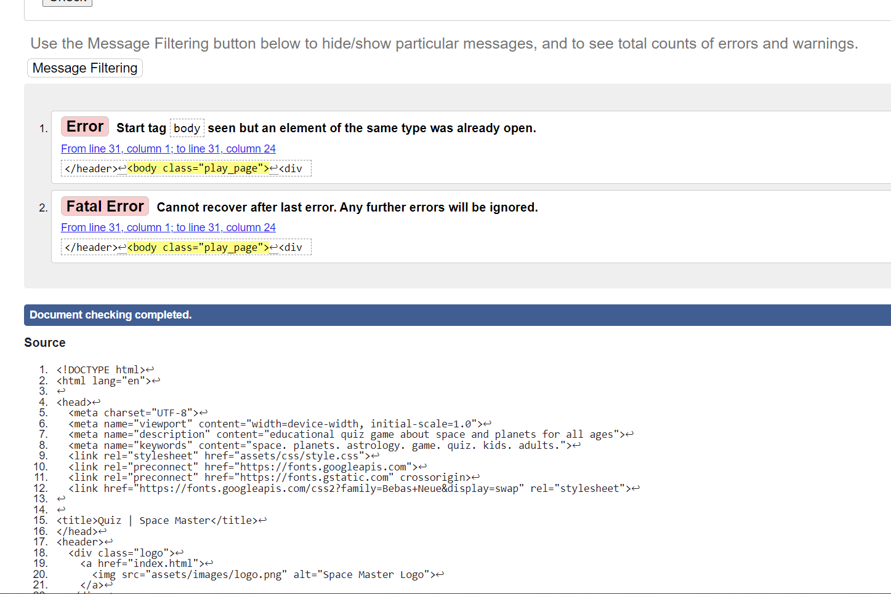

rules.html

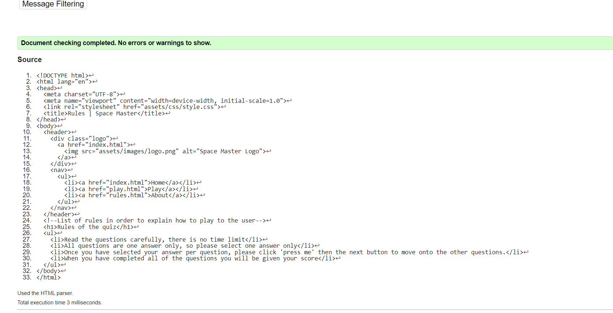

style.css

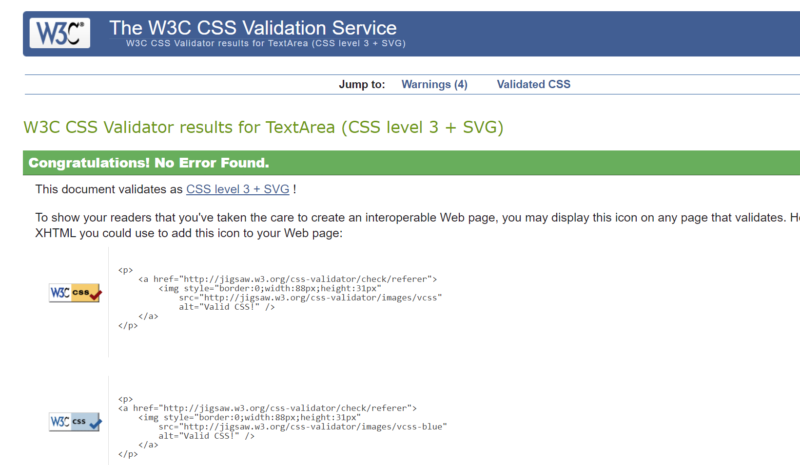

JavaScript

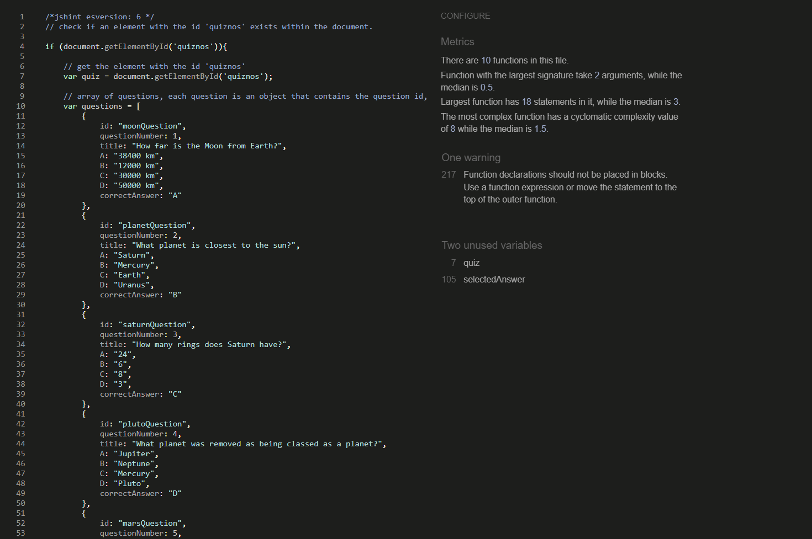

### Manual Testing

* The website was tested on Google Chrome, Microsoft Edge, and Opera browsers.
* The website was viewed on a desktop computer, laptop, and Samsung Galaxy A52 mobile phone.
* A large amount of testing was done to ensure links between pages are working correctly on all pages.
* Family and friends were asked to review the website for a better understanding of the user experience.
* Dev Tools was used to test how the site looks on various screen sizes.

### Lighthouse Report

#### Mobile analysis

Index Page

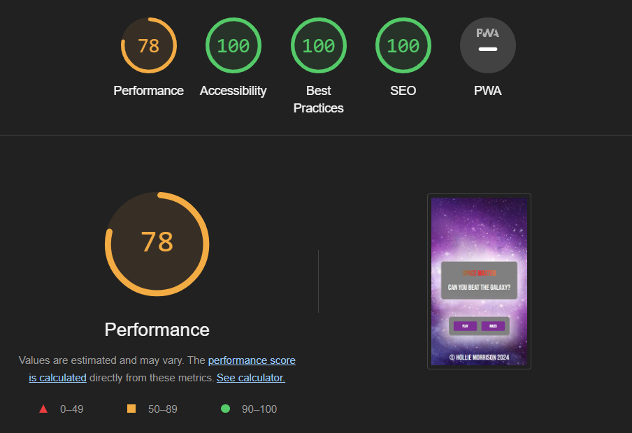

Play Page

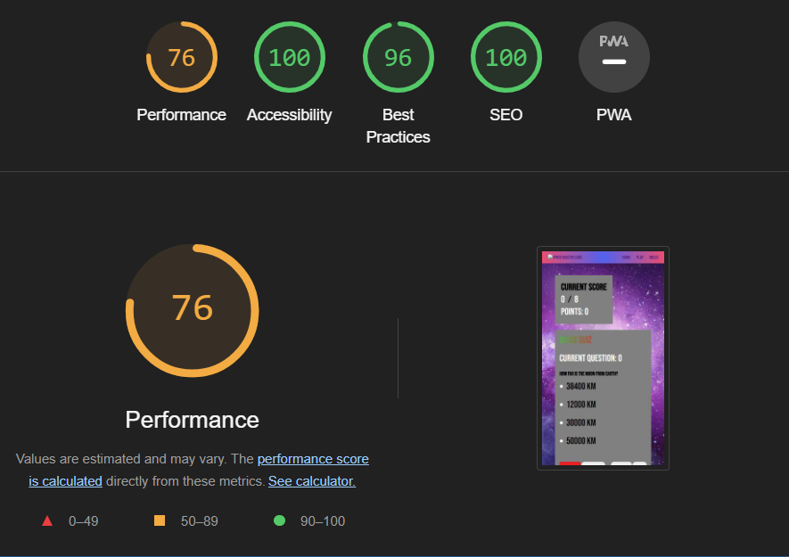

Rules Page

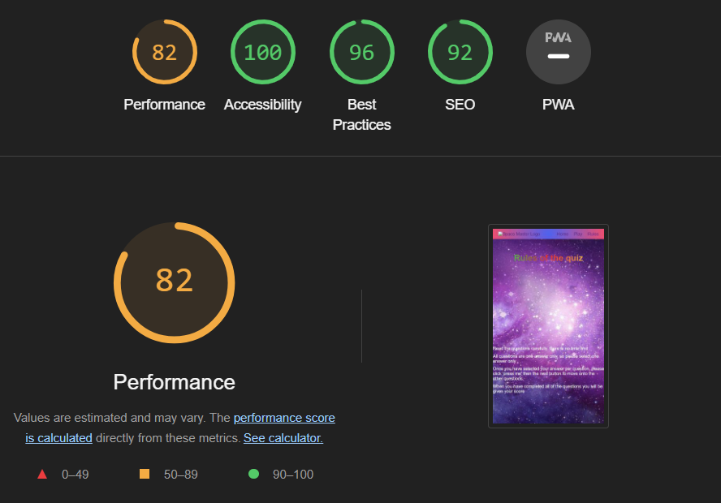

#### Desktop analysis

Index Page

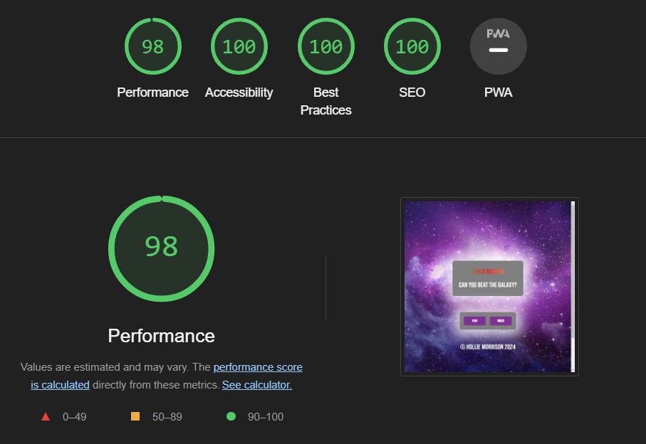

Play

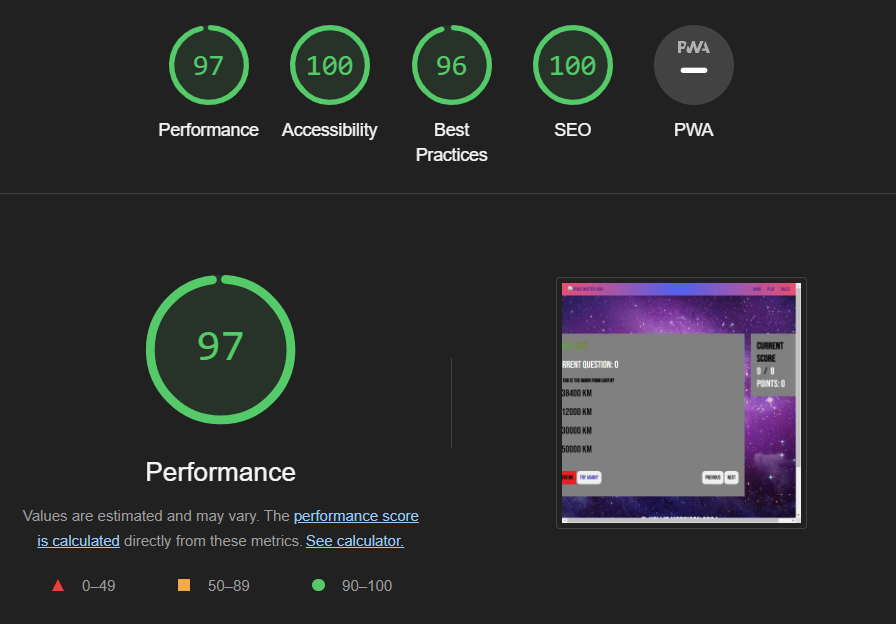

Rules Page

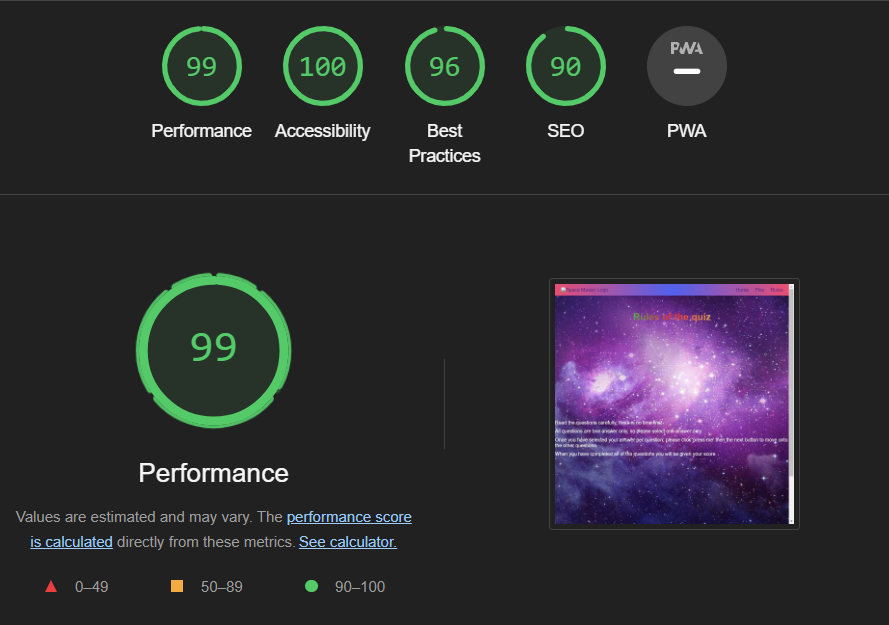

---

## Deployment and local development

### GitHub Pages

GitHub Pages used to deploy live version of the website.
1. Log in to GitHub and locate [GitHub Repository Space-master](https://holliemorrison.github.io/space-master/)
2. At the top of the Repository(not the main navigation) locate "Settings" button on the menu.
3. Scroll down the Settings page until you locate "GitHub Pages".
4. Under "Source", click the dropdown menu "None" and select "Main" and click "Save".
5. The page will automatically refresh.
6. Scroll back to locate the now-published site [link](https://holliemorrison.github.io/space-master/index.html) in the "GitHub Pages" section.

### Forking the GitHub Repository

By forking the repository, we make a copy of the original repository on our GitHub account to view and change without affecting the original repository by using these steps:

1. Log in to GitHub and locate [GitHub Repository Space-master](https://holliemorrison.github.io/space-master/)
2. At the top of the Repository(under the main navigation) locate "Fork" button.
3. Now you should have a copy of the original repository in your GitHub account.

### Local Clone

1. Log in to GitHub and locate [GitHub Repository Space-master](https://holliemorrison.github.io/space-master/)
2. Under the repository name click "Clone or download"
3. Click on the code button, select clone with HTTPS, SSH or GitHub CLI and copy the link shown.
4. Open Git Bash
5. Change the current working directory to the location where you want the cloned directory to be made.
6. Type `git clone` and then paste The URL copied in the step 3.
7. Press Enter and your local clone will be created.

---
## Credits

### Code
 * Understanding the concept of flexbox was learned through [Complete Guide to Flexbox](https://css-tricks.com/snippets/css/a-guide-to-flexbox/)
 * The README template was helpfully provided by [Code Institute (template)](https://github.com/Code-Institute-Solutions/SampleREADME)

### Content

 * Information about foods taken from [Google](https://www.google.com/)
 

### Media 

 * [Space Background Photo](https://www.google.co.uk/) Image of space from google images.
 
---

## Acknowledgements

 * My mentor Mitko Bachvarov provided helpful feedback regarding improvements and criteria.
 * Slack community for encouragement and information.